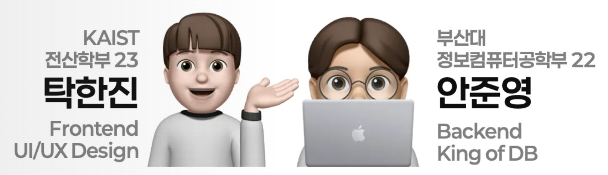

# 🕒 Momento
> **"계획적인 당신을 위한, 성장을 증명하는 가장 완벽한 플래너."**
> 개인의 몰입과 팀의 유기적인 협업을 데이터로 기록하고 시각화하는 스마트 시간 관리 시스템


---

## 📦 설치 및 다운로드
안드로이드 기기에서 Momento를 직접 체험해 보실 수 있습니다.

* **APK 다운로드**: [Momento 설치 파일 (Google Drive)](https://drive.google.com/file/d/1GPNHuKCrWRIxJZNE46zmXO-JCNvN7v24/view?usp=drive_link)
* **테스트 환경**: Galaxy S10e, Galaxy S22+ 검증 완료

---

## 👥 팀원 소개


---

## ❓ 문제 정의 (Problem Definition)
> **"평소에 계획을 좋아하지만 어떻게 계획해야 할지 몰랐거나, 세운 계획을 실천하는 과정을 시각화하고 싶으신가요?"**

많은 사람들이 목표를 세우지만, 그 목표를 달성하기 위한 세부 단위(Task)를 관리하고 시간을 배분하는 데 어려움을 겪습니다. **Momento**는 추상적인 계획을 구체적인 시간 기록으로 전환하여, 당신의 성취를 수치와 리포트로 증명합니다.

---

## 🛠️ 기술 스택 및 시스템 아키텍처

### 1. 기술 스택 (Tech Stack)
| 분류 | 기술 스택 | 비고 |
| :--- | :--- | :--- |
| **Infrastructure** | KCloud (Ubuntu 22.04 LTS), Nginx, PM2 | 서버 호스팅 및 프로세스 관리 |
| **Backend** | Node.js (v22.x), NestJS (v10.x), Prisma ORM | 서버 프레임워크 및 데이터베이스 접근 |
| **Database** | PostgreSQL (v16.x) | 메인 관계형 데이터베이스 |
| **Frontend** | React Native (Android) | 크로스 플랫폼 모바일 앱 개발 |
| **Communication** | REST API, Socket.io, Firebase Auth | 데이터 통신 및 사용자 인증 |

### 2. Momento의 구성 요소
* **Task**: 시간을 측정할 수 있는 기본 단위.
* **Project**: 여러 개의 Task로 구성된 장기 목표.
* **Personal Project**: 참여 인원이 1명인 개인용 프로젝트.
* **Team Project**: 참여 인원이 2명 이상인 협업용 프로젝트.


---

## ✨ 주요 기능 (Key Features)

### 1️⃣ 로그인 및 프로필 관리
* **Google Sign-in**: Firebase Auth 기반의 JWT 토큰 로그인 서비스.
* **커스텀 프로필**: 이모지 및 닉네임 수정 기능 (닉네임 중복 방지 포함).

| 로그인 페이지 애니메이션 | 이모지 및 프로필 수정 |
| :---: | :---: |
|  |  |

<br/>

### 2️⃣ 개인 프로젝트 (Personal Project)
* **프로젝트 관리**: 마감일(Due Date) 설정 및 Task 할당.
* **실시간 진행도**: 완료된 Task 비율에 따라 진행률 자동 계산.
  $$진행도 = 100 \times \frac{\text{완료된 Task 개수}}{\text{전체 Task 개수}}$$
* **집중 모드 (뽀모도로)**: 파도 모양 시계를 클릭하여 측정 기능에만 집중하는 간결한 UI 제공.

| 프로젝트 생성 및 관리 | 집중 모드 (뽀모도로) |
| :---: | :---: |
|  |  |

> **Exception Handler:** > - 프로젝트명/마감일 미입력 시 오류 메시지 발생.
> - 시간 측정 중인 Task는 삭제 버튼이 은닉되며, 해당 프로젝트 삭제 시 경고가 발생합니다.

<br/>

### 3️⃣ 팀 프로젝트 및 협업 (Team Project)
* **팀원 초대**: 닉네임 검색을 통해 프로젝트 생성 및 진행 중 팀원 추가 가능.
* **담당자 지정**: Task별 담당자를 배정하여 역할 분담을 명확히 함.
* **실시간 상태**: MemberCard를 통해 팀원별 진행도 확인 및 현재 측정 중인 인원 활성화 표시.

| 팀원 추가 및 스크롤 | 팀 프로젝트 관리 |
| :---: | :---: |
|  |  |

> **Exception Handler:** > - 담당자가 아닌 인원은 해당 Task 측정 불가.
> - 프로젝트 삭제 권한은 오직 생성자에게만 부여됨.

<br/>

### 4️⃣ 보고서 및 영수증 아카이빙 (Reporting & Archive)
* **보고서 제작**: 완료 프로젝트의 Task별 측정 시간을 파이 차트로 시각화.
* **일일 몰입 영수증**: 24시간을 10분 단위로 나누어, 집중한 시간을 **바코드 형태**로 시각화.
* **아카이브 탭**: 일일 영수증을 주간/월간 단위로 모아보고 이미지로 저장 가능.

| 상세 보고서 확인 (파이 테이블) | 일일 영수증 아카이브 |
| :---: | :---: |
|  |  |

<br/>

### 5️⃣ 스터디 탭 (Study Space)
* **공간 기반 협업**: 특정 위치(공간)에 있는 사용자들이 모여 실시간으로 서로의 스터디 현황을 공유합니다.
* 다중 인원의 실시간 시간 측정 현황을 한눈에 파악할 수 있습니다.

| 스터디 탭 시연 | 실시간 시간 측정 공유 |
| :---: | :---: |
|  |  |

---

## 📂 프로젝트 구조
```text
momento/
├── app/                     # 배포용 APK (momento.apk)
├── backend/                 # NestJS 서버 기반 백엔드
│   ├── prisma/              # DB Schema (PostgreSQL)
│   └── src/                 # Business Logic (Modules)
├── frontend/                # React Native 모바일 앱
│   ├── src/                 # Screens, Components, Hooks
│   └── android/             # Native Gradle Settings
└── image/                   # README 리소스 및 데모 GIF
